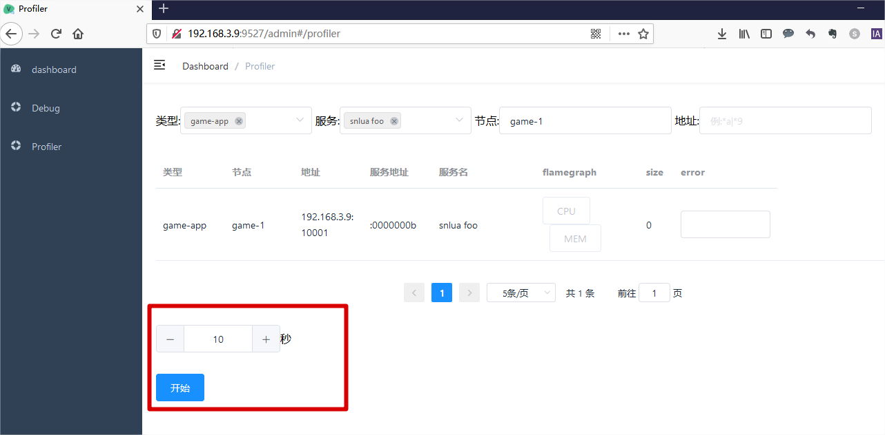
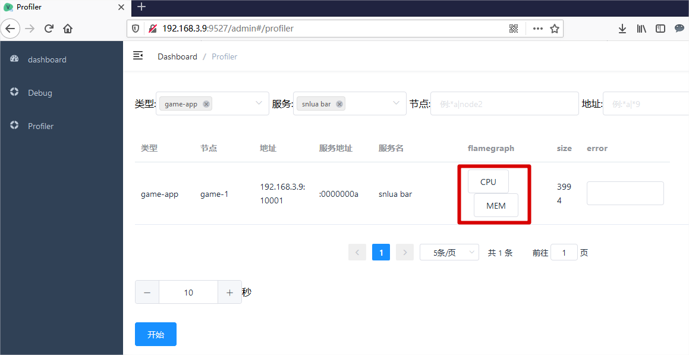
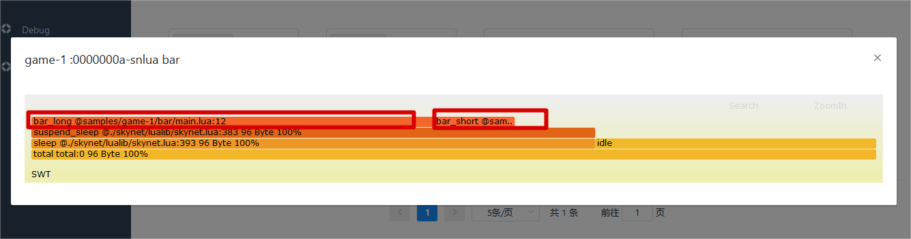
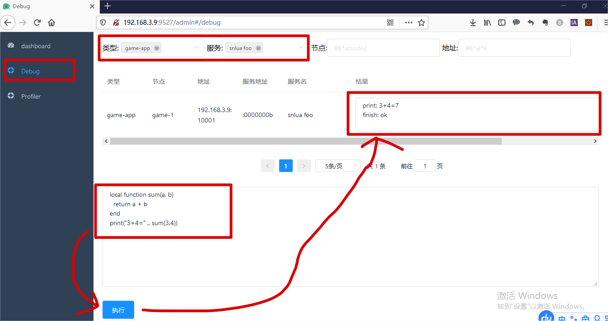

# swt
skynet 火焰图 flamegraph + debug, 运行过程中随时启停profiler,方便调试线上问题

## 架构设计

* 1个master服务：负责收集各个agent上报的profiler数据、提供admin网页服务；部署在某个中心（管理）进程上（ 如monitor 管理进程）
* 多个agent服务：负责收集所在节点的各个服务的profiler数据，并进行上报；部署在各个功能逻辑进程上（ 如game-1、game-2、game-3...）

## 使用示例
* 以下示例中，都是以 admin 和 vue 的共同目录作为【根目录】即【根目录】
* samples/monitor 为monitor进程，维护了 swt/master 服务
* samples/game-1 为功能逻辑进程（可多开为game-2/3)， 维护了以下内容：
    * swt/agent 服务, 用于上报profiler到 monitor/master 服务
    * bar 服务，消耗cpu和内存，用于后续火焰图展示
    * foo 服务，消耗cpu和内存，用于后续火焰图展示
* 启动 samples/game-1:
    ```sh
    ./build/skynet ./samples/game-1/config
    ```
    将会显示如下输出：
    ```txt
    [:00000002] LAUNCH snlua bootstrap
    [:00000003] LAUNCH snlua launcher
    [:00000004] LAUNCH snlua cdummy
    [:00000005] LAUNCH harbor 0 4
    [:00000006] LAUNCH snlua datacenterd
    [:00000007] LAUNCH snlua service_mgr
    [:00000008] LAUNCH snlua main
    [:00000009] LAUNCH snlua swt/agent
    swt/agent start listening at 0.0.0.0:10001...
    [:0000000a] LAUNCH snlua bar
    bar service started
    [:0000000b] LAUNCH snlua foo
    foo service started
    [:00000002] KILL self
    ```
    * 表明在当前机器上的 10001 端口开启了 swt/agent 功能，本例为 `192.168.3.9:10001`
    * 后续在admin管理页面对该 地址进行注册 以 关注 game-1 的profiler
* 启动 samples/monitor:
    ```sh
    ./build/skynet ./samples/monitor/config 
    ```
    将会显示如下输出：
    ```txt
    [:00000002] LAUNCH snlua bootstrap
    [:00000003] LAUNCH snlua launcher
    [:00000004] LAUNCH snlua cdummy
    [:00000005] LAUNCH harbor 0 4
    [:00000006] LAUNCH snlua datacenterd
    [:00000007] LAUNCH snlua service_mgr
    [:00000008] LAUNCH snlua main
    [:00000009] LAUNCH snlua swt/master
    [:00000002] KILL self
    swt/master start listening at 0.0.0.0:9527...
    ```
    表明在当前机器上的 9527端口开启了 swt/master 功能
* 访问 `http://<monitor>:9527/admin` 进入admin管理页面，进行agent管理， 本例为 `http://192.168.3.9:9527/admin`
    
* 在 `dashboard#dashboard` 分页，在输入框添加 game-1/agent地址（本例为 192.168.3.9:10001）并提交，即可以获取显示该节点的信息，包含节点类型、节点名称、地址和状态（具体的数据流可查阅 `doc/火焰图swt框架.xls/dashboard#注册agent`）：


* `dashboard#profiler` 性能监控
    * 在 `dashboard#profiler` 分页，选择【节点类型】【类型名称】【服务】会显示出这个服务的信息（具体的数据流程可查阅 `doc/火焰图swt框架.xls/profiler#获取节点的服务列表`）:
    

    * 调整进行监控的时长，点击【开始】按钮，即可以让所选择的服务马上开始监控，时间达到时自动结束监控(具体的数据流程可查阅 `doc/火焰图swt框架.xls/profiler#对节点的服务进行profiler`)：
    

    * 在监控结束后，`game-1/agent` 服务自动上报profiler结果到 `monitor/master`, 然后更新到 profiler页面上，此时服务行的【CPU】和【MEM】按钮变为可选状态：
    
    点击【CPU】按钮，可以查看到【函数调用关系和时长】的火焰图：
    
    在解析这个图前，先来看看 game-1/bar 服务做了什么：
        ```lua
        local skynet    = require "skynet"

        local function bar_short()
            local sum = 0
            for k = 1, 10000 do
                for h = 1, 10000 do
                    sum = sum + 1
                end
            end
        end

        local function bar_long()
            for k = 1, 5 do
                bar_short()
            end
        end

        local function bar_sub()
            local sum = 0
            for k = 1, 10000 do
                for h = 1, 10000 do
                    sum = sum + 1
                end
            end
            bar_short()
            bar_long()
        end

        local function bar_main()
            while true do
                local tb = {}
                for k = 1, 10000 do
                    tb[#tb+1] = k
                end
                bar_sub()
                skynet.sleep(100)
            end
        end

        skynet.start(function ()
            print("bar service started")
            skynet.fork(bar_main)
        end)

        ```
        主要是在 bar_main() 调用了长耗时的 bar_long() 和 短耗时的bar_short()
        在结合火焰图可以看出，bar_long() 的时长为 bar_short() 的5倍，和代码一样；而bar_long() 和 bar_short() 的上一层 bar_main() 则耗时更长一些，因为还有其他逻辑需要跑cpu
    【MEM】也类似的情况。

* `bashboard#debug` 对服务发起调试
如下图，选择 debug分页，选择好服务，例如foo服务，输入调试脚本内容，执行，最后可以在【结果栏】看到结果（具体的数据流程可查阅 `doc/火焰图swt框架.xls/debug#服务调试` ）


## 使用说明
* 以 admin 和 vue 的共同目录作为【根目录】即【根目录】
* 不管是 master 还是 agent，都依赖于skynet框架，在启动master和agent前，需要确保skynet已经构建完成
* master 的skynet并无版本要求
* agent 的skynet 需要包含项目的skynet改动，确认skynet版本是否一至,有一点[修改](https://github.com/lsg2020/skynet/commit/4ace42e80814abfff6b8e64335061a206c674f96)

## 如何构建
```sh
    git clone 本项目 swt
    cd swt
    make
```
将会编译出以下内容：
* `build/skynet`
* `build/clualib/cjson.so` # agent/master 数据交使用
* `build/clualib/profile.so` # agent 进行性能监控使用

## swt/master 相关
* swt/master 有两部分内容：【admin管理页面】和 【profile收集器】
* 第一种启动方式，【admin管理页面】和 【profile收集器】由同一个addr管理，如 "0.0.0.0:9527"
    * 可以在app内开启swt/master 服务：
    ``` lua
        local swt = require "swt"
        swt.start_master("0.0.0.0:9527") -- 监听地址
    ```

    * 也可以参考 samples/monitor/config 配置, `SWT_MASTER_PORT` 设置为 swt/master 后台的端口，例如 9527:
    ```sh
        ./build/skynet samples/monitor/config
    ```
    
    * 要注意的是，这种方式的启动，需要将工作目录定位到 【根目录】，因为这种方式是采用 static加载 admin/index.html
    * 启动成功后即可 进入管理界面，请查看前面的示例

* 第二种启动方式，将【admin管理页面】和 【profile收集器】分开启动
    * 【profile收集器】还是和第一种的启动方式，注意工作目录
    * 【admin管理页面】则通过 npm run 方式启动：
    ```sh
        # 如果启动失败，请看下面的两个注意点
        cd vue && npm run serve
    ```
    这是根据 npm 的启动提示，一般会有提示在 8080 开启了admin管理页面
    * 第一个注意点：为了让 admin(8080) 能够 和 【profile收集器】进行交互， 需要修改 vue/.env 的`VUE_APP_BASE_API` 设置为 【profile收集器】的地址:
    ```sh
        VUE_APP_BASE_API = 'http://<实际的对外ip>:9527'
    ```
    * 第二个注意点：如果 `npm run serve` 启动失败，活着对admin页面有进行修改，则需进行重新构建：
    ```sh
        # 只需要执行一次，用于初始化vue所需的各种依赖库
        cd vue && npm install

        # 如果npm run build 时出现 ERR_OSSL_EVP_UNSUPPORTED 报错问题，还是需要进行export:
        # export NODE_OPTIONS=--openssl-legacy-provider
        cd vue && npm run build
    ```

## swt/agent 相关
* profiler 的运行原理是通过inject方式 往服务里添加 start_profiler 和 end_profiler。
  服务需要对 `prototype=debug， cmd=SWT_RUN` 进行注册，一种注册方式是在skynet的config文件里添加proload设置，这样每个服在创建时就会自动进行协议注册，例如：
  ```lua
    preload = "../lualib/sfg/debug.lua"
    -- 或者在服务启动时 require "swt.debug"
  ```    

* 启动 swt/agent节点
    ``` lua
    local swt = require "swt"

    -- 类型名,节点名, 暴露给master连接的地址
    swt.start_agent("game-app", "game-1", "0.0.0.0:10001") 
    ```

    也可以参考 `samples/game-1/config` 配置:
    ```lua
        -- samples/game-1/config:
        SFG_NODE_TYPE = "game-app" -- 类型名
        SFG_NODE_NAME = "game-1" -- 节点名
        SFG_AGENT_PORT = 10001 -- 暴露给master连接的地址
    ```
    再进行启动:
    ```sh
        ./build/skynet samples/game-1/config
    ```

## 展示 


